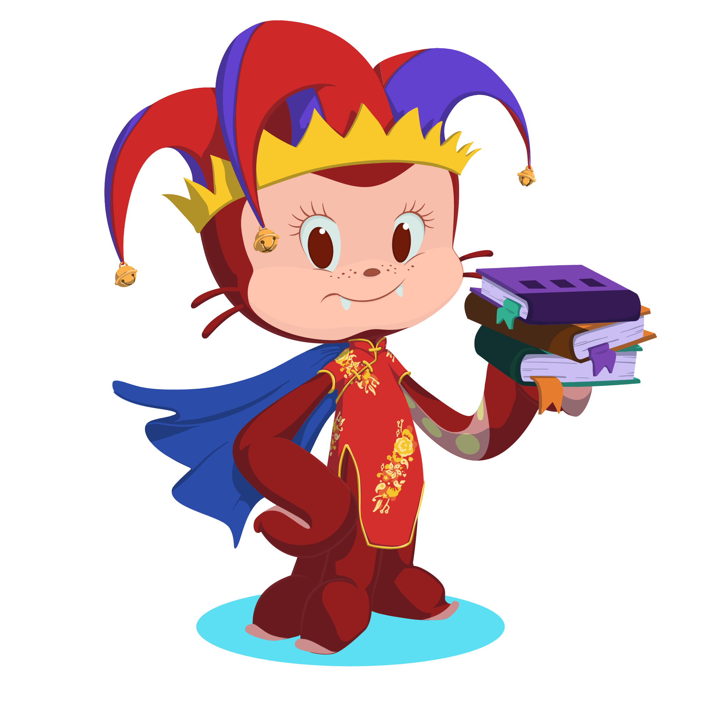

# Hi there I am Mello!

 

## 💫 About Me:
Site Reliability Engineer [@Cloudeteer](https://github.com/cloudeteer)  🖥️ Graduated apprenticeship at SAP SE in 2024 🌐 DD-IX Dresden Internet Exchange Co-Founder and Chairperson of the Board 💚  I am an open source and Linux enthusiast 🐧 Please be patient with me I am still learning 🌱 Proud cat parent of Bash 🐈‍⬛

## 🌐 Socials:
 
 

## 💻 Tech Stack:
                    

## 📊 GitHub Stats:

 

---

<!-- Proudly created with GPRM ( https://gprm.itsvg.in ) -->
